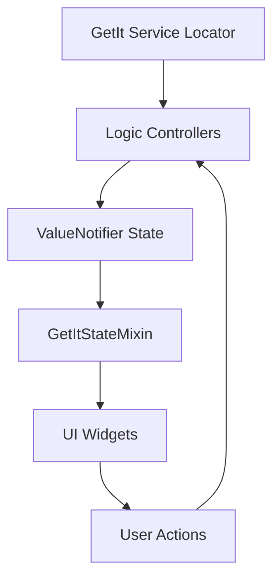

Wonderous uses a combination of **GetIt** for dependency injection and **Provider** (via GetItMixin) for reactive state management. This approach provides clean separation between business logic and UI while maintaining reactive updates.

## Architecture Pattern

The state management architecture follows these principles:

1. **Centralized Logic**: Business logic lives in singleton "logic" classes
2. **Dependency Injection**: GetIt manages service lifecycle and dependencies
3. **Reactive Bindings**: UI widgets watch specific state values
4. **Unidirectional Flow**: State flows from logic layer to UI layer



## GetIt Dependency Injection

### Service Registration

All logic controllers and services are registered as lazy singletons in `main.dart:78-99`:

```dart
void registerSingletons() {
  // Top level app controller
  GetIt.I.registerLazySingleton<AppLogic>(() => AppLogic());
  
  // Feature logic controllers
  GetIt.I.registerLazySingleton<WondersLogic>(() => WondersLogic());
  GetIt.I.registerLazySingleton<TimelineLogic>(() => TimelineLogic());
  GetIt.I.registerLazySingleton<SettingsLogic>(() => SettingsLogic());
  GetIt.I.registerLazySingleton<CollectiblesLogic>(() => CollectiblesLogic());
  GetIt.I.registerLazySingleton<UnsplashLogic>(() => UnsplashLogic());
  GetIt.I.registerLazySingleton<LocaleLogic>(() => LocaleLogic());
  
  // Services
  GetIt.I.registerLazySingleton<ArtifactAPILogic>(() => ArtifactAPILogic());
  GetIt.I.registerLazySingleton<ArtifactAPIService>(() => ArtifactAPIService());
  GetIt.I.registerLazySingleton<NativeWidgetService>(() => NativeWidgetService());
}
```

<Note>
  `registerLazySingleton` means instances are created only when first accessed, not at registration time.
</Note>

### Global Accessors

For convenience, logic controllers (not services) have global getters in `main.dart:101-110`:

```dart
// Logic controllers - encouraged for use in UI
AppLogic get appLogic => GetIt.I.get<AppLogic>();
WondersLogic get wondersLogic => GetIt.I.get<WondersLogic>();
TimelineLogic get timelineLogic => GetIt.I.get<TimelineLogic>();
SettingsLogic get settingsLogic => GetIt.I.get<SettingsLogic>();
UnsplashLogic get unsplashLogic => GetIt.I.get<UnsplashLogic>();
ArtifactAPILogic get artifactLogic => GetIt.I.get<ArtifactAPILogic>();
CollectiblesLogic get collectiblesLogic => GetIt.I.get<CollectiblesLogic>();
LocaleLogic get localeLogic => GetIt.I.get<LocaleLogic>();
```

<Warning>
  Services like `ArtifactAPIService` deliberately **do not** have global accessors. This encourages using logic controllers as the interface layer, keeping services isolated.
</Warning>

### Why Lazy Singletons?

**Benefits:**
- Single instance ensures consistent state across the app
- Lazy initialization improves startup performance
- No need to pass dependencies through widget tree
- Easy to mock for testing

## Reactive State with Provider

### GetItStateMixin

UI widgets use `GetItStateMixin` to reactively watch state changes:

```dart
class _WondersAppState extends State<WondersApp> with GetItStateMixin {
  @override
  Widget build(BuildContext context) {
    // Watch specific value - widget rebuilds when locale changes
    final locale = watchX((SettingsLogic s) => s.currentLocale);
    
    return MaterialApp.router(
      locale: locale == null ? null : Locale(locale),
      // ... other properties
    );
  }
}
```

The `watchX` method:
1. Retrieves the service from GetIt
2. Listens to the specific `ValueNotifier` property
3. Automatically rebuilds the widget when value changes

### ValueNotifier Pattern

Logic classes expose state as `ValueNotifier` properties. From `SettingsLogic` in `lib/logic/settings_logic.dart:5-13`:

```dart
class SettingsLogic with ThrottledSaveLoadMixin {
  late final hasCompletedOnboarding = ValueNotifier<bool>(false)
    ..addListener(scheduleSave);
  
  late final hasDismissedSearchMessage = ValueNotifier<bool>(false)
    ..addListener(scheduleSave);
  
  late final isSearchPanelOpen = ValueNotifier<bool>(true)
    ..addListener(scheduleSave);
  
  late final currentLocale = ValueNotifier<String?>(null)
    ..addListener(scheduleSave);
}
```

**Key Points:**
- Each piece of state is a separate `ValueNotifier`
- Listeners can be attached for side effects (like auto-saving)
- UI can watch individual properties granularly

## Logic Controller Pattern

### Structure of a Logic Class

Logic controllers follow a consistent pattern. Example from `CollectiblesLogic`:

```dart
class CollectiblesLogic with ThrottledSaveLoadMixin {
  @override
  String get fileName => 'collectibles.dat';

  // Data
  final List<CollectibleData> all = collectiblesData;

  // Reactive State
  late final statesById = ValueNotifier<Map<String, int>>({})
    ..addListener(_updateCounts);

  // Derived State (computed from reactive state)
  int _discoveredCount = 0;
  int get discoveredCount => _discoveredCount;

  // Service Dependencies
  late final _nativeWidget = GetIt.I<NativeWidgetService>();

  // Initialization
  void init() => _nativeWidget.init();

  // Business Logic Methods
  void setState(String id, int state) {
    Map<String, int> states = Map.of(statesById.value);
    states[id] = state;
    statesById.value = states; // Triggers listeners
    scheduleSave();
  }

  // Private Helpers
  void _updateCounts() {
    // Update derived state when reactive state changes
  }
}
```

### Common Patterns

<Accordion title="Reactive State Updates">
  ```dart
  // Update ValueNotifier to trigger UI rebuild
  void updateValue() {
    myValue.value = newValue; // All watchers rebuild
  }
  ```
</Accordion>

<Accordion title="Service Access from Logic">
  ```dart
  class MyLogic {
    // Access other services via GetIt
    late final _apiService = GetIt.I<ArtifactAPIService>();
    
    Future<void> doWork() async {
      final data = await _apiService.fetchData();
      // Process data...
    }
  }
  ```
</Accordion>

<Accordion title="Initialization and Bootstrap">
  ```dart
  class AppLogic {
    Future<void> bootstrap() async {
      // Load settings
      await settingsLogic.load();
      
      // Initialize data
      wondersLogic.init();
      timelineLogic.init();
      
      // Load user data
      await collectiblesLogic.load();
    }
  }
  ```
</Accordion>

## State Persistence

### ThrottledSaveLoadMixin

Many logic classes use `ThrottledSaveLoadMixin` for automatic state persistence:

```dart
mixin ThrottledSaveLoadMixin {
  late final _file = JsonPrefsFile(fileName);
  final _throttle = Throttler(const Duration(seconds: 2));

  Future<void> load() async {
    final results = await _file.load();
    copyFromJson(results);
  }

  Future<void> save() async {
    await _file.save(toJson());
  }

  Future<void> scheduleSave() async => _throttle.call(save);

  // Must be implemented by using class
  String get fileName;
  Map<String, dynamic> toJson();
  void copyFromJson(Map<String, dynamic> value);
}
```

**Features:**
- **Throttled Saves**: Prevents excessive disk writes (max once per 2 seconds)
- **JSON Serialization**: Simple key-value persistence
- **Automatic Loading**: Called during app bootstrap
- **Listener Integration**: Attach to `ValueNotifier` for auto-save on change

### Usage Example

From `SettingsLogic`:

```dart
class SettingsLogic with ThrottledSaveLoadMixin {
  @override
  String get fileName => 'settings.dat';

  // Auto-save when value changes
  late final hasCompletedOnboarding = ValueNotifier<bool>(false)
    ..addListener(scheduleSave);

  @override
  Map<String, dynamic> toJson() {
    return {
      'hasCompletedOnboarding': hasCompletedOnboarding.value,
      'currentLocale': currentLocale.value,
    };
  }

  @override
  void copyFromJson(Map<String, dynamic> value) {
    hasCompletedOnboarding.value = value['hasCompletedOnboarding'] ?? false;
    currentLocale.value = value['currentLocale'];
  }
}
```

## Watching State in Widgets

### Basic Watching

Use `GetItStateMixin` to watch state in stateful widgets:

```dart
class MyWidget extends StatefulWidget {
  @override
  State<MyWidget> createState() => _MyWidgetState();
}

class _MyWidgetState extends State<MyWidget> with GetItStateMixin {
  @override
  Widget build(BuildContext context) {
    // Watch single value
    final count = watchX((CollectiblesLogic c) => c.discoveredCount);
    
    return Text('Discovered: $count');
  }
}
```

### Stateless Widget Watching

For stateless widgets, use `GetItStatefulWidgetMixin`:

```dart
class WondersApp extends StatefulWidget with GetItStatefulWidgetMixin {
  WondersApp({super.key});

  @override
  State<WondersApp> createState() => _WondersAppState();
}

class _WondersAppState extends State<WondersApp> with GetItStateMixin {
  @override
  Widget build(BuildContext context) {
    final locale = watchX((SettingsLogic s) => s.currentLocale);
    // Use locale...
  }
}
```

### Multiple Watchers

```dart
@override
Widget build(BuildContext context) {
  // Watch multiple independent values
  final locale = watchX((SettingsLogic s) => s.currentLocale);
  final onboardingComplete = watchX((SettingsLogic s) => s.hasCompletedOnboarding);
  final discoveredCount = watchX((CollectiblesLogic c) => c.discoveredCount);
  
  // Widget rebuilds when ANY watched value changes
  return Column(
    children: [
      Text('Locale: $locale'),
      Text('Onboarding: $onboardingComplete'),
      Text('Discovered: $discoveredCount'),
    ],
  );
}
```

## Direct Logic Access (Non-Reactive)

For one-time reads or calling methods without watching:

```dart
class MyWidget extends StatelessWidget {
  @override
  Widget build(BuildContext context) {
    return ElevatedButton(
      onPressed: () {
        // Direct access - no rebuild when state changes
        settingsLogic.hasCompletedOnboarding.value = true;
        
        // Call methods
        wondersLogic.init();
        collectiblesLogic.setState('id', CollectibleState.discovered);
      },
      child: Text('Complete Onboarding'),
    );
  }
}
```

<Tip>
  Use direct access for:
  - Calling methods that mutate state
  - One-time reads that don't need reactivity
  - Event handlers
  
  Use `watchX` for:
  - Values displayed in UI
  - Conditional rendering based on state
  - Any value that should trigger rebuild
</Tip>

## Service Layer

### Services vs. Logic Controllers

**Logic Controllers** (`*Logic`):
- Expose state via `ValueNotifier`
- Have global accessors for UI access
- Manage business logic and orchestration
- Examples: `AppLogic`, `SettingsLogic`, `WondersLogic`

**Services** (`*Service`):
- Pure data fetching or platform integration
- NO global accessors (accessed via GetIt internally)
- Stateless utilities
- Examples: `ArtifactAPIService`, `NativeWidgetService`

### Service Example

From `ArtifactAPIService`:

```dart
class ArtifactAPIService {
  // Not exposed globally, accessed via GetIt inside logic
  Future<List<Artifact>> search(String query) async {
    // API call
    final response = await http.get(url);
    return parseArtifacts(response);
  }
}

class ArtifactAPILogic {
  // Logic class wraps service
  late final _service = GetIt.I<ArtifactAPIService>();
  
  // Exposed to UI
  Future<void> searchArtifacts(String query) async {
    final results = await _service.search(query);
    // Process results, update state
  }
}
```

## State Flow Example

Here's a complete example of state flow from user action to UI update:

```dart
// 1. User taps button in UI
ElevatedButton(
  onPressed: () {
    // 2. Call logic method
    collectiblesLogic.setState('artifact-123', CollectibleState.discovered);
  },
  child: Text('Discover'),
)

// 3. Logic updates ValueNotifier
class CollectiblesLogic {
  late final statesById = ValueNotifier<Map<String, int>>({});
  
  void setState(String id, int state) {
    Map<String, int> states = Map.of(statesById.value);
    states[id] = state;
    statesById.value = states; // Notifies listeners
    scheduleSave(); // Persist to disk
  }
}

// 4. UI widget watches state and rebuilds
class CollectiblesDisplay extends StatefulWidget {
  @override
  State<CollectiblesDisplay> createState() => _CollectiblesDisplayState();
}

class _CollectiblesDisplayState extends State<CollectiblesDisplay> 
    with GetItStateMixin {
  @override
  Widget build(BuildContext context) {
    // Rebuilds automatically when statesById changes
    final states = watchX((CollectiblesLogic c) => c.statesById);
    
    return ListView(
      children: states.entries.map((e) => 
        ListTile(title: Text('${e.key}: ${e.value}'))
      ).toList(),
    );
  }
}
```

## Benefits of This Approach

<CardGroup cols={2}>
  <Card title="Testability" icon="flask">
    Logic classes are pure Dart with no Flutter dependencies, easy to unit test
  </Card>
  <Card title="Reusability" icon="recycle">
    Business logic is completely separate from UI, can be reused across platforms
  </Card>
  <Card title="Performance" icon="gauge-high">
    Granular reactivity means only affected widgets rebuild
  </Card>
  <Card title="Maintainability" icon="wrench">
    Clear separation of concerns makes codebase easy to navigate and modify
  </Card>
</CardGroup>

## Common Patterns

### Derived State

Compute values from reactive state without storing redundantly:

```dart
class CollectiblesLogic {
  late final statesById = ValueNotifier<Map<String, int>>({})..addListener(_updateCounts);
  
  // Derived state - computed from statesById
  int _discoveredCount = 0;
  int get discoveredCount => _discoveredCount;
  
  void _updateCounts() {
    _discoveredCount = 0;
    statesById.value.forEach((_, state) {
      if (state == CollectibleState.discovered) _discoveredCount++;
    });
  }
}
```

### Cross-Logic Communication

```dart
class SettingsLogic {
  Future<void> changeLocale(Locale value) async {
    currentLocale.value = value.languageCode;
    await localeLogic.loadIfChanged(value);
    
    // Notify other logic controllers to refresh localized data
    wondersLogic.init();
    timelineLogic.init();
  }
}
```

### Conditional Initialization

```dart
class AppLogic {
  bool isBootstrapComplete = false;

  Future<void> bootstrap() async {
    // Initialize all logic controllers
    await settingsLogic.load();
    wondersLogic.init();
    await collectiblesLogic.load();
    
    isBootstrapComplete = true;
  }
}
```

## Next Steps

<CardGroup cols={2}>
  <Card title="Architecture Overview" icon="building" href="/architecture/overview">
    Review high-level architecture principles
  </Card>
  <Card title="Project Structure" icon="folder-tree" href="/architecture/project-structure">
    Explore how code is organized in the project
  </Card>
</CardGroup>